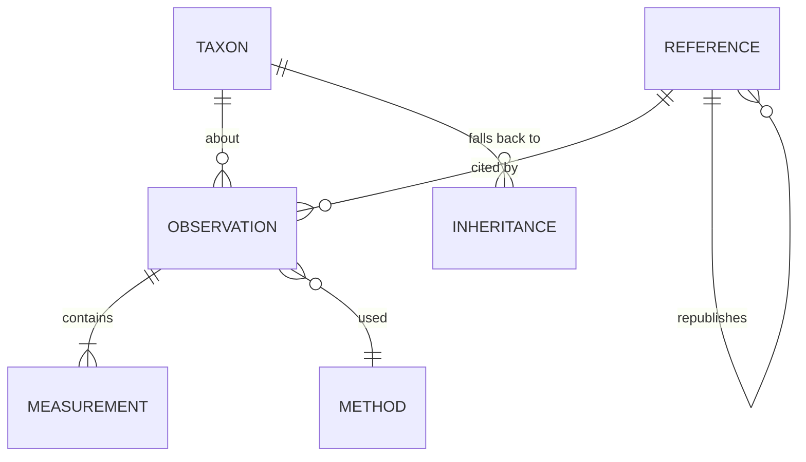

# Echolocation reference dataset — design sketch

Status: schema implemented; roadmap §10 Step 2 complete (321 species imported from Castro 2024). Next: §10.3 Step 1 (Pteropodidae) and migration of the 13 remaining legacy entries.
Scope: the reference data layer behind the **Call** section of `chiroptera-tree.html`.
Relates to: Phase 3 of [chiroptree-implementation-plan.md](chiroptree-implementation-plan.md).

## 1. Why the current shape cannot scale

`data/call_measurements.json` today stores, per MDD ID, one object:

```json
"1004776": {
  "summary": "Peak frequency ~56 kHz, bandwidth 6 kHz, duration 6.7 ms (oral emission).",
  "context": "Comparative database entry; body mass 9.05 g.",
  "reference": "castro-2024"
}
```

Coverage: 300 of 1,514 species (19.8%), 286 of them from one source.

Four properties block growth:

1. **The fact is a sentence, not a number.** Nothing can be queried, sorted, unit-checked, plotted, or compared across sources. The `~` in `~56 kHz` is prose, not a stated uncertainty.
2. **One row per species.** A second source for *Pipistrellus pipistrellus* has nowhere to go. `merge_species()` therefore drops it (`skipped_existing`) — the store silently discards evidence, and import order becomes an undocumented authority ranking.
3. **No call phase.** A search-phase and a terminal-buzz measurement of the same species differ by tens of kHz and an order of magnitude in repetition rate. Storing one unlabelled number per species conflates them.
4. **No derivation chain.** `castro-2024` is labelled "data from Collen 2012" in a free-text string. The dataset cannot answer "which values ultimately trace to Collen's EchoBank?" — which matters, because large comparative tables tend to re-publish the same handful of underlying compilations, and naive aggregation would count them as independent agreement.

## 2. What "accountable" has to mean here

Six properties, each of which drives a schema decision below.

| # | Property | Test it must pass |
|---|---|---|
| A1 | **Attributable** | Every displayed number resolves to a reference *and a locator within it* (table 3, row 44 / p. 907 / fig. 2b). "See paper" is not a citation. |
| A2 | **Re-checkable** | A reader given the record can open the source and confirm the number without re-running our pipeline. The verbatim published string and verbatim taxon name are kept alongside the parsed value. |
| A3 | **Reproducible** | Every row names the importer script and the hash of the cached raw file it came from. Re-running the importer on the same cached bytes reproduces the row exactly. |
| A4 | **Non-destructive** | Conflicting sources coexist as separate rows. Nothing is dropped at import. What the card shows is a *view* chosen by a written rule, computed at export time — not a deletion at import time. |
| A5 | **Honest about absence** | Three distinct states, never merged: measured, inherited from a higher taxon (explicitly labelled), and unknown. Plus a fourth positive claim: *no laryngeal echolocation* (most Pteropodidae) is an assertion with a source, not missing data. |
| A6 | **Separates measurement from interpretation** | Numbers are stored; prose is generated from them at build time. Any editorial sentence not derivable from stored numbers is its own record type with its own source. |

A5 is worth stressing: the honest headline for this dataset is coverage, and coverage must be reportable per family rather than hidden. A page that shows 20% coverage truthfully is more useful than one that pads it out with genus-level guesses.

## 3. Record model

Five entities. Canonical store is SQLite (per the existing plan); the browser gets a generated JSON export.



### 3.1 `reference` — a publication or dataset

One row per source artefact. The recursive `republishes` link is what makes the derivation chain work.

| Field | Notes |
|---|---|
| `reference_id` | slug, e.g. `castro-2024` |
| `type` | `journal_article` / `thesis` / `book` / `call_library` / `dataset` / `agency_report` |
| `citation` | full bibliographic string |
| `doi`, `url`, `accessed_at` | |
| `licence` | required before we redistribute any extracted table |
| `republishes_reference_id` | nullable; `castro-2024` → `collen-2012` |
| `independence_group` | sources sharing an underlying data pool get the same group, so agreement between them is not counted as corroboration |
| `geographic_scope`, `taxonomic_scope` | e.g. "Switzerland", "Vespertilionidae" — drives the "is this the right reference for this species?" review |

### 3.2 `observation` — one taxon, one source, one context

The join level. Everything shared by a group of numbers lives here, so measurements stay thin.

| Field | Notes |
|---|---|
| `observation_id` | |
| `mdd_id` | resolved MDD species ID, **or null** if unresolved |
| `verbatim_taxon_name` | exactly as printed in the source (A2) |
| `taxon_match_method` | `exact` / `synonym_via_mdd` / `manual` / `unresolved` |
| `reference_id`, `locator` | A1 — e.g. `table 3, row 44` |
| `call_phase` | `search` / `approach` / `terminal_buzz` / `social` / `distress` / `unspecified` |
| `call_variant`, `variant_label`, `signal_direction` | Named signal type within a phase, for species that alternate between distinct calls. Added after the barbastellus worked example (§9) showed that phase alone cannot separate them. |
| `signal_type` | `CF` / `FM` / `QCF` / `CF-FM` / `FM-QCF` / `broadband_click` / `none` |
| `duty_cycle_class` | `low` / `high` |
| `emission` | `oral` / `nasal` / `tongue_click` |
| `habitat_class` | `open` / `edge` / `clutter` (Schnitzler & Kalko categories) |
| `recording_condition` | `free_flying_wild` / `hand_release` / `flight_room` / `tethered` / `roost_emergence` — probably the largest hidden source of between-study variation, so it must never be null-by-default |
| `country`, `locality`, `lat`, `lon`, `date_or_season` | |
| `n_individuals`, `n_calls`, `sex`, `age_class` | |
| `body_mass_g`, `forearm_mm` | frequently co-reported; useful and cheap to keep |
| `method_id` | → §3.4 |
| `extraction` | `manual` / `script:<name>`, with `raw_file_sha256` (A3) |
| `extracted_by`, `extracted_at`, `verified_by`, `verified_at` | a row not yet verified by a second pass is flagged, not hidden |
| `notes` | |

### 3.3 `measurement` — one number

Long format, not wide columns. New parameters then need no schema change.

| Field | Notes |
|---|---|
| `observation_id` | |
| `parameter` | controlled vocabulary, §3.5 |
| `statistic` | `mean` / `median` / `min` / `max` / `mode` / `range` / `single` / `approximate` — vocabulary lives in `parameters.json` |
| `value`, `value_min`, `value_max` | `range` uses the min/max pair; point statistics use `value` |
| `unit` | controlled: `kHz` / `ms` / `dB_SPL` / `percent` / `count_per_s` / `degrees` / `m` |
| `dispersion_type`, `dispersion_value` | `sd` / `se` / `ci95_half_width` |
| `harmonic` | which harmonic the value refers to — a genuine ambiguity in the CF-FM literature |
| `verbatim_value` | `"56 ± 2.1"` exactly as printed (A2) |
| `quality_flag` | `ok` / `unit_inferred` / `harmonic_ambiguous` / `definition_unstated` / `digitised_from_figure` / `derived` / `suspect` — vocabulary lives in `parameters.json` |

### 3.4 `method` — how the number was produced

Two studies reporting "peak frequency" may not mean the same quantity. Without this, cross-source comparison is not defensible.

Fields: `recorder_model`, `microphone`, `sample_rate_khz`, `analysis_software`, `fft_window`, `fft_size`, `frequency_definition` (`max_energy_in_power_spectrum` / `characteristic_frequency_endpoint` / `knee` / `unstated`), `duration_threshold_db`, `detection_threshold`.

`unstated` is a first-class value and will be the most common one. That is fine — recording it as unstated is the accountable outcome.

### 3.5 Parameter registry — `data/calls/parameters.json`

Not a frozen list. The vocabulary is data, held in [`data/calls/parameters.json`](data/calls/parameters.json) and read at run time by [`data/calls/parameter_registry.py`](data/calls/parameter_registry.py). No importer, validator or export step names a parameter in code, so **adding a parameter is an edit to one JSON file** followed by `uv run data/calls/parameter_registry.py --check`.

Currently registered: 37 parameters across 7 groups (17 `core`, 15 `extended`, 5 `proposed`), with 161 source-heading aliases.

| Group | Parameters |
|---|---|
| `signal_structure` | `signal_type`, `duty_cycle_class`, `emission`, `harmonic_emphasis`, `harmonic_count`, `doppler_shift_compensation` |
| `spectral` | `peak_frequency`, `characteristic_frequency`, `start_frequency`, `end_frequency`, `min_frequency`, `max_frequency`, `bandwidth`, `bandwidth_3db`, `bandwidth_10db`, `cf_frequency`, `resting_frequency`, `knee_frequency`, `sweep_rate`, `q_factor` |
| `temporal` | `duration`, `cf_duration`, `fm_duration`, `inter_pulse_interval`, `pulse_rate`, `duty_cycle`, `buzz_duration` |
| `amplitude` | `source_level` |
| `beam` | `beam_half_angle`, `directionality_index`, `detection_distance` |
| `auditory` | `best_hearing_frequency`, `acoustic_fovea_frequency` |
| `covariate` | `body_mass`, `forearm_length`, `wing_aspect_ratio`, `wing_loading` |

Each entry carries `value_type`, canonical `unit`, plausible range, definition, and — where the literature disagrees about what the quantity means — an `ambiguity` note that travels with the value into the UI.

**Categorical parameters live here too.** This is a change from §3.2: `signal_type`, `duty_cycle_class` and `emission` were originally fixed columns on `observation`, which would have made only half the vocabulary expandable. They are now registry entries with closed `values` vocabularies, stored as measurements with the same provenance as any number. `observation` keeps only the columns describing *what the observation is of* — taxon, source, phase, place, condition, sample.

Four registry features do real work:

- **`aliases`** map source column headings to parameter ids. Castro 2024's `Band`, `BM`, `Call Dur`, `PF` and `Ech.T` all resolve without code; so do `FmaxE`, `Fc`, `Fk`, `IPI`, `SPL`, `RF`. Meeting a new heading means adding a string, not editing an importer.
- **`unit_conversions`** coerce to canonical units, so a source reporting Hz or seconds needs no bespoke handling. Cross-dimension errors are caught: duration in kHz is rejected.
- **`sane_min`/`sane_max`** catch transcription slips at import (560 kHz fails; 56 passes).
- **Alias collision detection** refuses to load a registry where two parameters claim the same heading. This already caught a genuine trap: sources print *"minimum frequency"* both for the literal spectral minimum and for the terminal frequency of an FM sweep, which coincide only for a monotonic downward sweep. Rather than silently picking one, the registry keeps such headings on the literal parameter and records the conflict in `ambiguity`; a source using the other sense must be mapped explicitly in its own importer. The same applies to `start_frequency` vs `max_frequency`.

`status` gates display: `core` may appear on the species card, `extended` in the detail view, `proposed` is registered but not yet backed by an import. Ids are never renamed or deleted once imported against — deprecation sets `status: deprecated` and `superseded_by`.

**Resolution is deliberately fallible.** `resolve()` returns `None` for an unrecognised heading rather than guessing, and the importer reports it for a human decision — the column gets an alias, or it is out of scope.

### 3.6 `inheritance` — labelled fallback

A separate table, so a family guide can never be mistaken for a species measurement. Holds `mdd_id`, `inherited_from_taxon`, `rank`, `reference_id`, `evidence_scope`. The existing `data/call-records.json` family guide migrates here unchanged in content — it already carries `evidenceScope: family-guide`.

## 4. What the page shows

The card renders a computed **display view**, generated at build time, never hand-edited. It is **progressive**: a species with real data can easily carry twenty measurements, which is reference material, not a card. So each call variant collapses to one line and expands on demand.

**Collapsed** — the orienting layer. One headline sentence, then one row per call variant showing only the frequency span and the peak:

```text
Alternates 2 search-call types, emitted through different routes and aimed in different directions.
  ▸ Type 1   FM  oral  downward    31.2–35.9 kHz · peak 33.6 kHz
  ▸ Type 2   FM  nasal upward      35.1–44.3 kHz · peak 40.1 kHz
  1 Seibert et al. 2015   2 Denzinger et al. 2001   3 Goerlitz et al. 2010
  Species measurement · 3 sources, 2 independent · 5 observations
```

**Expanded** — every measurement with its statistic, dispersion, n, basis, agreement mark, quality flag and competing values.

Three rules keep it uncluttered without losing accountability:

- **The headline carries no numbers.** The variant rows already show span and peak; a headline repeating them is duplication. It states instead what the rows cannot — the contrast between variants.
- **Citations are numbered, not named, at the point of use.** A superscript keyed to one reference list below the card, rather than "Seibert et al. 2015" repeated against eight values. Every value still resolves to a source; it just costs one character instead of twenty.
- **The frequency span is labelled by provenance.** Where a source reports only sweep endpoints rather than explicit min/max, `overview.derived_from` says so, so the row never implies a measurement that was not made.

```json
"1005649": {
  "evidence_scope": "species_measurement",
  "headline": "Alternates 2 search-call types, emitted through different routes…",
  "variants": [{
    "id": "type_1", "label": "Type 1 (oral, directed downward)",
    "signal_type": "FM", "emission": "oral", "direction": "downward",
    "overview": {"low": 31.2, "high": 35.9, "peak": 33.6,
                 "derived_from": "sweep start and end frequency"},
    "facts": [{"parameter": "peak_frequency", "display": "33.6 ± 1.1 kHz",
               "agreement": "corroborated", "ref_index": 1, "n_calls": "86",
               "alternatives": [{"display": "median 33 kHz", "ref_index": 3}]}]
  }],
  "reference_order": ["seibert-2015", "denzinger-2001", "goerlitz-2010"],
  "n_observations": 5, "n_sources": 3, "n_independent_groups": 2
}
```

Selection rule — written down, applied mechanically, in order:

1. `quality_flag` is `ok` (a flagged value never outranks a clean one);
2. `recording_condition = free_flying_wild`;
3. highest `n_calls`;
4. most recent reference year.

**Values only compete when the method makes them the same quantity.** A parameter may declare `comparability_fields` naming the method fields that must match; values with different keys are shown side by side as separate facts rather than ranked against each other. `source_level` declares `source_level_reference_distance_m` and `source_level_type`, which is what stops 94 dB peSPL at 10 cm and 80.9 dB rms at 1 m from being treated as a 13 dB disagreement (§9).

Disagreements are not resolved away. `agreement` takes five values, because whether sources are independent changes what agreement means:

| Value | Meaning |
|---|---|
| `corroborated` | Sources in different independence groups agree within tolerance. The strongest evidence available. |
| `consistent_within_group` | Sources agree, but share an origin — not independent confirmation. |
| `divergent` | Independent sources disagree by more than the tolerance. |
| `divergent_within_group` | Sources sharing an origin still disagree — usually a method difference worth surfacing. |
| `single_source` | Nothing to compare against. |

Tolerance is 15% of the mean by default. The card shows the mark, the losing values, and their citations.

## 5. Ingest format

One CSV per source in `data/calls/<reference_id>.csv`, plus `references.json` holding the `reference` records. Rationale for CSV over writing JSON directly: a CSV is the shape a supplementary table already arrives in, and it can be diffed, reviewed in a PR, and hand-corrected without a script. Metadata files stay JSON to match the rest of the repo and to avoid adding a YAML dependency (the project currently depends only on `python-docx`).

```text
data/
  calls/
    parameters.json              the parameter registry (§3.5)
    parameter_registry.py        loader, alias resolution, unit coercion, validation
    references.json              all reference records, incl. republishes links
    castro-2024.csv              one row per (taxon, phase, parameter)
    obrist-2004.csv
    chirovox.csv
  raw/                           cached source artefacts + sha256 (A3)
  build_calls.py                 csv -> sqlite -> exports
  exports/calls.json             display view consumed by the page
  exports/calls-full.json        (optional) full record set for a detail view
```

Because a row is `(taxon, phase, parameter, value, unit)`, a source reporting a parameter nobody has recorded before needs no new column anywhere — only a registry entry.

One importer per source stays — `build_castro_calls.py` is the right pattern and `call_import_lib.py` keeps its role. What changes: an importer emits rows into a reviewable CSV rather than writing the final store, and `merge_species`'s first-wins skip is replaced by append.

## 6. Source register

To be verified and licence-checked before any harvesting — these are candidates, not confirmed-available sources:

- **Comparative compilations** — Collen 2012 (EchoBank, UCL thesis), the apparent upstream of Castro 2024 and likely of others; Jones & Holderied 2007; Schnitzler & Kalko 2001.
- **Call libraries with per-recording metadata** — ChiroVox, and regional libraries for Europe (Barataud), Britain, Australasia, the Neotropics, and southern/eastern Africa.
- **Repositories** — Zenodo, Dryad, Figshare; searched by DOI and filtered to redistributable licences.
- **Reference works** — *Handbook of the Mammals of the World* vol. 9; regional field guides.
- **Per-paper extraction** — a standing literature search, one importer per paper that yields a species-level table.

Licence is a hard gate. A source we may read but not redistribute can still back individual cited figures; a bulk table under a restrictive licence does not get committed. Each `reference` row records which case applies.

## 7. Validation gates

**Fail** on: a `parameter`, `unit` or categorical value the registry rejects; a measurement with no `reference_id` + locator; a value outside its registered `sane_min`/`sane_max`; an `mdd_id` absent from the current taxonomy; a `verbatim_value` that does not re-parse to the stored `value`; a display-view entry marked `species_measurement` with zero backing observations; a registry that fails its own `--check` (missing keys, undeclared group, colliding alias, numeric parameter with no unit or range).

**Warn** on: unresolved taxon names (reported as a list, as `report()` already does); `recording_condition` or `frequency_definition` unstated; a species whose independent sources are `divergent`; a family below a coverage threshold.

**Report every build**: coverage per family (species with ≥1 measurement / total), observation count, independent-source count, and species still relying on family-guide inheritance.

## 8. Migration from the current store

1. Freeze `call_measurements.json`; write `build_calls.py` against the new schema.
2. Re-target `build_castro_calls.py` at the CSV output. Its table 3 headings (`Band`, `BM`, `Call Dur`, `PF`, `Ech.T`) already resolve through the registry, so it becomes structured rows with no re-reading of the source and no column mapping in code. Its `Ech.T` values need a one-time check against the `emission` vocabulary, since the current importer coerces anything not `oral` to `nasal` — which would mask a `tongue_click` or an unstated value.
3. Hand-enter the 14 curated non-Castro entries (Obrist, Denzinger, Vaughan, Teixeira) with real locators — small enough to do properly.
4. Move `call-records.json` families into `inheritance`.
5. Regenerate the display view and confirm the card renders identically for the 300 species already covered, before adding any new source.
6. Only then start harvesting.

Step 5 is the safety line: the schema change ships with zero visible change, so any later difference on the page is attributable to new data rather than to the migration.

## 9. Worked example — *Barbastella barbastellus*

Done end to end before any bulk harvesting, to stress the schema on a species with genuinely awkward data. Sources: [Denzinger et al. 2001](https://doi.org/10.1007/s003590100223), [Goerlitz et al. 2010](https://doi.org/10.1016/j.cub.2010.07.046), [Seibert et al. 2015](https://doi.org/10.1371/journal.pone.0135590).

**Before** — one prose string: *"Search calls: 31–44 kHz, 2 ms."*
**After** — 27 measurement rows across 5 observations from 3 sources in 2 independence groups, split into the two alternating call types.

Five things the exercise changed:

1. **`call_variant` had to be added.** Barbastellus alternates two search calls that differ in frequency, duration, emission route and beam direction. Both are `call_phase: search`, so phase could not separate them — and the old single-slot record had flattened them into a range (`31–44 kHz`) that describes neither call. This is a schema gap that only appeared under real data.

2. **`comparability_fields` had to be added**, and it is the most important finding. Goerlitz reports 94 dB peSPL at 10 cm; Seibert reports 80.9 dB SPL rms at 1 m. Naively these look like a 13 dB contradiction. They are not in conflict at all — they differ by ~20 dB of spreading loss plus the peak-to-rms offset, and are broadly consistent once reconciled. Any pipeline that ranked or averaged them would have produced a confident wrong number. The card now shows both, each labelled with its basis.

3. **Independence groups earn their place.** Denzinger is an author on both the 2001 and 2015 papers, so those share the `denzinger-tuebingen` group; Goerlitz is independent. When Seibert's 33.6 ± 1.1 kHz peak frequency matches Goerlitz's median of 33 kHz, that is real corroboration across groups. When Seibert and Denzinger agree, it is not.

4. **A real divergence surfaced rather than being hidden.** Denzinger gives type 2 duration as ~6 ms; Seibert gives 2.5 ± 0.4 ms for the same signal type. That is a factor of 2.4 and it is flagged `divergent_within_group`. The likely cause is a different duration threshold, which is exactly why `method.duration_threshold_db` exists — and both sources leave it unstated, so both rows carry `definition_unstated`. First-source-wins would have silently kept whichever importer ran first.

5. **The registry absorbed a new parameter with no code change.** Goerlitz's headline result is the distance at which a moth hears the *bat* — the inverse of `detection_distance`, and merging them would be a category error. Adding `moth_detection_distance` was one JSON object; nothing else was edited.

Also added while doing the work: the `approximate` statistic (Denzinger's "around 6 ms" is a hedged value, not a mean), and the `definition_unstated` and `derived` quality flags.

**Deviation from the plan:** the canonical SQLite store in §3 is not built yet. The path is CSV → validate → JSON export, which is enough to prove the schema and keeps the diff reviewable. SQLite becomes worthwhile when volume or cross-species querying demands it; nothing here forecloses it.

## 10. Roadmap to full coverage

Baseline when this roadmap was written: **300 of 1,514 species (19.8%)**, 299 as unstructured prose. After Step 2: **323 of 1,514 (21.3%)** — 321 structured, 2 still legacy prose. Density: 1 `rich`, 322 `minimal`.

### 10.1 The gap is four problems, not one

| Tier | Species | What it is | Cost per species |
|---|---|---|---|
| 0 | ~203 | Not a gap. Pteropodidae do not echolocate laryngeally — a sourced positive claim, not missing data | minutes (family-level) |
| 1 | 296 | Castro/Collen comparative table, importer already written, needs re-import as structured rows | seconds (mechanical) |
| 2 | unknown | Bulk sources not yet touched: regional call libraries, atlases, repository datasets | ~1 day per source, tens–hundreds of species each |
| 3 | the tail | Per-paper extraction, the barbastellus treatment | ~1 species per session |

### 10.2 Coverage by family

Sorted by absolute gap. The concentration matters more than the percentage: five families hold 84% of the missing species.

| Family | Total | Covered | Gap | % |
|---|---:|---:|---:|---:|
| Vespertilionidae | 558 | 122 | 436 | 22% |
| Pteropodidae | 203 | 0 | 203 | 0% |
| Phyllostomidae | 231 | 47 | 184 | 20% |
| Molossidae | 133 | 18 | 115 | 14% |
| Rhinolophidae | 118 | 34 | 84 | 29% |
| Hipposideridae | 94 | 25 | 69 | 27% |
| Emballonuridae | 55 | 19 | 36 | 35% |
| Miniopteridae | 41 | 7 | 34 | 17% |
| *remaining 13 families* | 81 | 28 | 53 | 35% |
| **Total** | **1514** | **300** | **1214** | **20%** |

Worst genera by gap: *Myotis* 105, *Rhinolophus* 84, *Pteropus* 65, *Hipposideros* 55, *Murina* 48, *Miniopterus* 34, *Mops* 32. 202 of 238 genera have at least one uncovered species.

### 10.3 Sequence

**Step 1 — Pteropodidae as a positive claim (~203 species, hours).**
The single best return in the project. 196 species get `signal_type: none`; the 7 *Rousettus* get `broadband_click` / `tongue_click`. Needs one or two solid references and the `inheritance` table from §3.6 for the family-level assertion, with *Rousettus* as species-level records. **Takes headline coverage from 20% to 33% without a single new measurement**, because it converts "no data" into "answered".

**Step 2 — Castro re-import as structured rows. ✅ Done.**
1,605 rows for **321 species**, up from the 296 estimated. 5 parameters each (peak frequency, bandwidth, duration, body mass, emission), no phase, no method — every one lands at density `minimal`, which is the honest result and exactly why §10.4 exists. Coverage 19.8% → 21.3%.

Three things worth recording:

- **The taxonomy problem was smaller than feared.** 25 of the 33 unmatched names resolve 1:1 through `MSW3_sciName`, MDD's own record of the prior name — pure genus reassignments (*Chaerephon*→*Mops*, *Artibeus*→*Dermanura*, *Eptesicus*→*Cnephaeus*/*Neoeptesicus*, *Pipistrellus*→*Alionoctula*), not splits. **Zero ambiguous cases**, so open question 8 did not block this step after all. It will still bite on older sources. The remaining 8 are parked in `data/calls/unresolved/castro-2024.md` for a human decision, not guessed at.
- **A broad source silently shadowed narrower ones.** On first run, 11 species lost their Obrist/Vaughan/Teixeira values because the structured Castro record replaced the legacy entry wholesale — first-source-wins reappearing at the legacy/structured boundary. The builder now carries any shadowed legacy entry through as `unmigrated`, displays it on the card, and reports the count at every build. Migrating those 13 entries properly (§8 step 3) is the next small job.
- **A comparative table is not a call type.** Castro's rows have no `call_variant`, so for barbastellus they initially rendered as a *third* alternating signal type. Unattributed rows are now labelled "Not attributed to a call type" and sorted last, and the headline counts only named variants.

Method note: Castro rows carry `quality_flag: ok` rather than `definition_unstated`. The unknown is a property of the whole source, not of individual values, so it lives in the method record (`castro-2024-unstated`, every field unstated) where §3.4 says it belongs, and surfaces through the density marker. Flagging all 1,605 rows individually would have been noise. The ranking still demotes them: a source with a stated recording condition and sample size outranks one without.

**Step 3 — survey Tier 2 sources (~1 week, no data written).**
The step that determines everything after it, and the one that cannot be estimated until it is done. For each candidate in §6: does it exist, does it publish species-level values, what licence, how many species, is there a machine-readable table. Output is a costed list, not data. **Do not start bulk importing before this.**

**Step 4 — wire up family-guide inheritance (all remaining species).**
`call-records.json` already holds family-level guides. Displaying them through the `inheritance` table gives every one of the 1,514 cards something honest to say, clearly labelled as a family expectation rather than a measurement. This is the fastest route to a tree that is *filled out*, and it is orthogonal to how many species are ever measured.

**Step 5 — import Tier 2 sources**, highest species-per-day first, re-running the coverage report after each.

**Step 6 — the tail, selectively.** Reserve per-paper extraction for species that are charismatic, ecologically important, or acoustically unusual. It does not scale and should not be attempted as a sweep.

### 10.4 Data density marker

Steps 2 and 5 will put thin entries next to rich ones. A Castro row is six bare numbers; barbastellus is 27 rows with dispersion, sample sizes and method. Both are legitimately "species measurements", and without a marker the thin card reads as though the rich card is broken.

Every species entry therefore carries a `density` block: a level (`minimal` / `basic` / `detailed` / `rich`), the parameter count, and named lists of what is present and absent. The card shows four bars and the level word, with the components as a tooltip — so it states exactly what is missing rather than showing an unexplained score.

| Level | Requires |
|---|---|
| `rich` | ≥6 parameters, dispersion, sample size, phase + recording condition, and either method or independent corroboration |
| `detailed` | ≥4 parameters, phase + recording condition, and dispersion or sample size |
| `basic` | ≥3 parameters with phase + recording condition |
| `minimal` | anything less — including every legacy prose entry, by construction |

Current distribution: 1 `rich`, 322 `minimal`. The marker is also the progress metric for this roadmap — the goal is not only more covered species but fewer `minimal` ones.

### 10.5 Two things that cap coverage below 100%

**The literature does not exist for much of the order.** The gap concentrates in genera that are both speciose and poorly studied — *Murina* (48 uncovered), *Kerivoula* (21), *Mops* (32), *Alionoctula* (19, a recent split with essentially no acoustic literature under that name). Many species are known from a handful of specimens. A realistic ceiling is probably somewhere near half the order, but that is a guess and Step 3 should replace it with a measurement.

**Taxonomic drift is the harder limit.** 33 of Castro's 329 names (10%) do not resolve against MDD v2.5, and that is a 2024 paper; older sources will be worse. More seriously, MDD splits mean a source's *Hipposideros commersoni* may now be three species and the recording often cannot be assigned to one. This needs a policy decision (§11): drop such records, or admit them at genus level with an explicit evidence scope. The `taxon_match_method` and `inheritance` fields already support either choice.

## 11. Open questions

1. Full per-observation detail in the card, or a link out? Decides whether `calls-full.json` ships to the browser, and its size.
2. Is 15% on peak frequency the right divergence tolerance, and what is the equivalent for duration?
3. Do we accept values digitised from figures, flagged as such, or exclude them?
4. Is species-level the floor, or do we also want population rows where sources report them (relevant for *Rhinolophus* CF-frequency clines)?
5. Who is the second pass for `verified_by`, given a single maintainer?
6. Which of the 5 `proposed` parameters are worth chasing sources for, and should any `extended` one be promoted to `core` and shown on the card?
7. `detection_distance` is nearly always modelled rather than measured. Keep it in the same table with a flag, or split derived quantities out entirely?
8. **Taxonomic drift policy (blocks Step 2).** When a source's name has since been split into several MDD species and the recording cannot be assigned, do we drop the record or admit it at genus level with an explicit evidence scope?
9. Should `minimal`-density entries appear on the card at all, or only once a species reaches `basic`?
