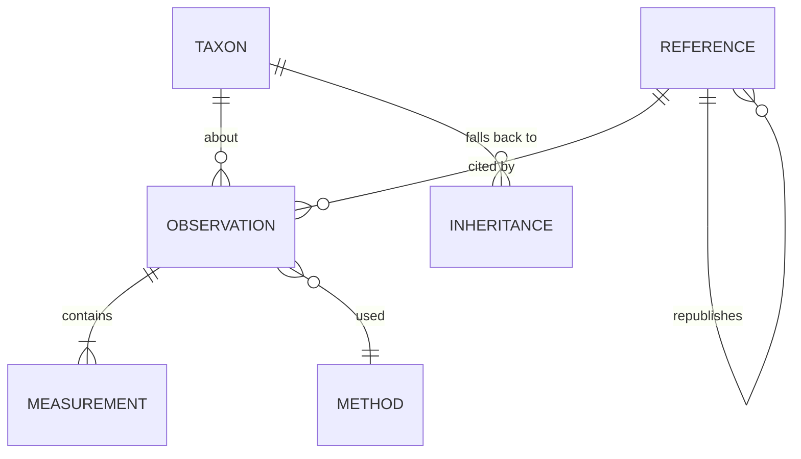

# Echolocation reference dataset — design sketch

Status: schema implemented; roadmap §10 Steps 2, 2b, 3b and 4 complete. 324 species measured (21.4%); the remaining 1,190 cards show labelled family-level inference. Next: §10.3 Step 1 (Pteropodidae species records) and Step 3 (source survey).
Scope: the reference data layer behind the **Call** section of `chiroptera-tree.html`.
Relates to: Phase 3 of [chiroptree-implementation-plan.md](chiroptree-implementation-plan.md).

## 1. Why the current shape cannot scale

`data/call_measurements.json` today stores, per MDD ID, one object:

```json
"1004776": {
  "summary": "Peak frequency ~56 kHz, bandwidth 6 kHz, duration 6.7 ms (oral emission).",
  "context": "Comparative database entry; body mass 9.05 g.",
  "reference": "castro-2024"
}
```

Coverage: 300 of 1,514 species (19.8%), 286 of them from one source.

Four properties block growth:

1. **The fact is a sentence, not a number.** Nothing can be queried, sorted, unit-checked, plotted, or compared across sources. The `~` in `~56 kHz` is prose, not a stated uncertainty.
2. **One row per species.** A second source for *Pipistrellus pipistrellus* has nowhere to go. `merge_species()` therefore drops it (`skipped_existing`) — the store silently discards evidence, and import order becomes an undocumented authority ranking.
3. **No call phase.** A search-phase and a terminal-buzz measurement of the same species differ by tens of kHz and an order of magnitude in repetition rate. Storing one unlabelled number per species conflates them.
4. **No derivation chain.** `castro-2024` is labelled "data from Collen 2012" in a free-text string. The dataset cannot answer "which values ultimately trace to Collen's EchoBank?" — which matters, because large comparative tables tend to re-publish the same handful of underlying compilations, and naive aggregation would count them as independent agreement.

## 2. What "accountable" has to mean here

Six properties, each of which drives a schema decision below.

| # | Property | Test it must pass |
|---|---|---|
| A1 | **Attributable** | Every displayed number resolves to a reference *and a locator within it* (table 3, row 44 / p. 907 / fig. 2b). "See paper" is not a citation. |
| A2 | **Re-checkable** | A reader given the record can open the source and confirm the number without re-running our pipeline. The verbatim published string and verbatim taxon name are kept alongside the parsed value. |
| A3 | **Reproducible** | Every row names the importer script and the hash of the cached raw file it came from. Re-running the importer on the same cached bytes reproduces the row exactly. |
| A4 | **Non-destructive** | Conflicting sources coexist as separate rows. Nothing is dropped at import. What the card shows is a *view* chosen by a written rule, computed at export time — not a deletion at import time. |
| A5 | **Honest about absence** | Three distinct states, never merged: measured, inherited from a higher taxon (explicitly labelled), and unknown. Plus a fourth positive claim: *no laryngeal echolocation* (most Pteropodidae) is an assertion with a source, not missing data. |
| A6 | **Separates measurement from interpretation** | Numbers are stored; prose is generated from them at build time. Any editorial sentence not derivable from stored numbers is its own record type with its own source. |

A5 is worth stressing: the honest headline for this dataset is coverage, and coverage must be reportable per family rather than hidden. A page that shows 20% coverage truthfully is more useful than one that pads it out with genus-level guesses.

## 3. Record model

Five entities. Canonical store is SQLite (per the existing plan); the browser gets a generated JSON export.



### 3.1 `reference` — a publication or dataset

One row per source artefact. The recursive `republishes` link is what makes the derivation chain work.

| Field | Notes |
|---|---|
| `reference_id` | slug, e.g. `castro-2024` |
| `type` | `journal_article` / `thesis` / `book` / `call_library` / `dataset` / `agency_report` |
| `citation` | full bibliographic string |
| `doi`, `url`, `accessed_at` | |
| `licence` | required before we redistribute any extracted table |
| `republishes_reference_id` | nullable; `castro-2024` → `collen-2012` |
| `independence_group` | sources sharing an underlying data pool get the same group, so agreement between them is not counted as corroboration |
| `geographic_scope`, `taxonomic_scope` | e.g. "Switzerland", "Vespertilionidae" — drives the "is this the right reference for this species?" review |

### 3.2 `observation` — one taxon, one source, one context

The join level. Everything shared by a group of numbers lives here, so measurements stay thin.

| Field | Notes |
|---|---|
| `observation_id` | |
| `mdd_id` | resolved MDD species ID, **or null** if unresolved |
| `verbatim_taxon_name` | exactly as printed in the source (A2) |
| `taxon_match_method` | `exact` / `synonym_via_mdd` / `manual` / `unresolved` |
| `reference_id`, `locator` | A1 — e.g. `table 3, row 44` |
| `call_phase` | `search` / `approach` / `terminal_buzz` / `social` / `distress` / `unspecified` |
| `call_variant`, `variant_label`, `signal_direction` | Named signal type within a phase, for species that alternate between distinct calls. Added after the barbastellus worked example (§9) showed that phase alone cannot separate them. |
| `signal_type` | `CF` / `FM` / `QCF` / `CF-FM` / `FM-QCF` / `broadband_click` / `none` |
| `duty_cycle_class` | `low` / `high` |
| `emission` | `oral` / `nasal` / `tongue_click` |
| `habitat_class` | `open` / `edge` / `clutter` (Schnitzler & Kalko categories) |
| `recording_condition` | `free_flying_wild` / `hand_release` / `flight_room` / `tethered` / `roost_emergence` — probably the largest hidden source of between-study variation, so it must never be null-by-default |
| `country`, `locality`, `lat`, `lon`, `date_or_season` | |
| `n_individuals`, `n_calls`, `sex`, `age_class` | |
| `body_mass_g`, `forearm_mm` | frequently co-reported; useful and cheap to keep |
| `method_id` | → §3.4 |
| `extraction` | `manual` / `script:<name>`, with `raw_file_sha256` (A3) |
| `extracted_by`, `extracted_at`, `verified_by`, `verified_at` | a row not yet verified by a second pass is flagged, not hidden |
| `notes` | |

### 3.3 `measurement` — one number

Long format, not wide columns. New parameters then need no schema change.

| Field | Notes |
|---|---|
| `observation_id` | |
| `parameter` | controlled vocabulary, §3.5 |
| `statistic` | `mean` / `median` / `min` / `max` / `mode` / `range` / `single` / `approximate` — vocabulary lives in `parameters.json` |
| `value`, `value_min`, `value_max` | `range` uses the min/max pair; point statistics use `value` |
| `unit` | controlled: `kHz` / `ms` / `dB_SPL` / `percent` / `count_per_s` / `degrees` / `m` |
| `dispersion_type`, `dispersion_value` | `sd` / `se` / `ci95_half_width` |
| `harmonic` | which harmonic the value refers to — a genuine ambiguity in the CF-FM literature |
| `verbatim_value` | `"56 ± 2.1"` exactly as printed (A2) |
| `quality_flag` | `ok` / `unit_inferred` / `harmonic_ambiguous` / `definition_unstated` / `digitised_from_figure` / `derived` / `suspect` — vocabulary lives in `parameters.json` |

### 3.4 `method` — how the number was produced

Two studies reporting "peak frequency" may not mean the same quantity. Without this, cross-source comparison is not defensible.

Fields: `recorder_model`, `microphone`, `sample_rate_khz`, `analysis_software`, `fft_window`, `fft_size`, `frequency_definition` (`max_energy_in_power_spectrum` / `characteristic_frequency_endpoint` / `knee` / `unstated`), `duration_threshold_db`, `detection_threshold`.

`unstated` is a first-class value and will be the most common one. That is fine — recording it as unstated is the accountable outcome.

### 3.5 Parameter registry — `data/calls/parameters.json`

Not a frozen list. The vocabulary is data, held in [`data/calls/parameters.json`](data/calls/parameters.json) and read at run time by [`data/calls/parameter_registry.py`](data/calls/parameter_registry.py). No importer, validator or export step names a parameter in code, so **adding a parameter is an edit to one JSON file** followed by `uv run data/calls/parameter_registry.py --check`.

Currently registered: 37 parameters across 7 groups (17 `core`, 15 `extended`, 5 `proposed`), with 161 source-heading aliases.

| Group | Parameters |
|---|---|
| `signal_structure` | `signal_type`, `duty_cycle_class`, `emission`, `harmonic_emphasis`, `harmonic_count`, `doppler_shift_compensation` |
| `spectral` | `peak_frequency`, `characteristic_frequency`, `start_frequency`, `end_frequency`, `min_frequency`, `max_frequency`, `bandwidth`, `bandwidth_3db`, `bandwidth_10db`, `cf_frequency`, `resting_frequency`, `knee_frequency`, `sweep_rate`, `q_factor` |
| `temporal` | `duration`, `cf_duration`, `fm_duration`, `inter_pulse_interval`, `pulse_rate`, `duty_cycle`, `buzz_duration` |
| `amplitude` | `source_level` |
| `beam` | `beam_half_angle`, `directionality_index`, `detection_distance` |
| `auditory` | `best_hearing_frequency`, `acoustic_fovea_frequency` |
| `covariate` | `body_mass`, `forearm_length`, `wing_aspect_ratio`, `wing_loading` |

Each entry carries `value_type`, canonical `unit`, plausible range, definition, and — where the literature disagrees about what the quantity means — an `ambiguity` note that travels with the value into the UI.

**Categorical parameters live here too.** This is a change from §3.2: `signal_type`, `duty_cycle_class` and `emission` were originally fixed columns on `observation`, which would have made only half the vocabulary expandable. They are now registry entries with closed `values` vocabularies, stored as measurements with the same provenance as any number. `observation` keeps only the columns describing *what the observation is of* — taxon, source, phase, place, condition, sample.

Four registry features do real work:

- **`aliases`** map source column headings to parameter ids. Castro 2024's `Band`, `BM`, `Call Dur`, `PF` and `Ech.T` all resolve without code; so do `FmaxE`, `Fc`, `Fk`, `IPI`, `SPL`, `RF`. Meeting a new heading means adding a string, not editing an importer.
- **`unit_conversions`** coerce to canonical units, so a source reporting Hz or seconds needs no bespoke handling. Cross-dimension errors are caught: duration in kHz is rejected.
- **`sane_min`/`sane_max`** catch transcription slips at import (560 kHz fails; 56 passes).
- **Alias collision detection** refuses to load a registry where two parameters claim the same heading. This already caught a genuine trap: sources print *"minimum frequency"* both for the literal spectral minimum and for the terminal frequency of an FM sweep, which coincide only for a monotonic downward sweep. Rather than silently picking one, the registry keeps such headings on the literal parameter and records the conflict in `ambiguity`; a source using the other sense must be mapped explicitly in its own importer. The same applies to `start_frequency` vs `max_frequency`.

`status` gates display: `core` may appear on the species card, `extended` in the detail view, `proposed` is registered but not yet backed by an import. Ids are never renamed or deleted once imported against — deprecation sets `status: deprecated` and `superseded_by`.

**Resolution is deliberately fallible.** `resolve()` returns `None` for an unrecognised heading rather than guessing, and the importer reports it for a human decision — the column gets an alias, or it is out of scope.

### 3.6 `inheritance` — labelled fallback

A separate table, so a family guide can never be mistaken for a species measurement. Holds `mdd_id`, `inherited_from_taxon`, `rank`, `reference_id`, `evidence_scope`. The existing `data/call-records.json` family guide migrates here unchanged in content — it already carries `evidenceScope: family-guide`.

## 4. What the page shows

The card renders a computed **display view**, generated at build time, never hand-edited. It is **progressive**: a species with real data can easily carry twenty measurements, which is reference material, not a card. So each call variant collapses to one line and expands on demand.

**Collapsed** — the orienting layer. One headline sentence, then one row per call variant showing only the frequency span and the peak:

```text
Alternates 2 search-call types, emitted through different routes and aimed in different directions.
  ▸ Type 1   FM  oral  downward    31.2–35.9 kHz · peak 33.6 kHz
  ▸ Type 2   FM  nasal upward      35.1–44.3 kHz · peak 40.1 kHz
  1 Seibert et al. 2015   2 Denzinger et al. 2001   3 Goerlitz et al. 2010
  Species measurement · 3 sources, 2 independent · 5 observations
```

**Expanded** — every measurement with its statistic, dispersion, n, basis, agreement mark, quality flag and competing values.

Three rules keep it uncluttered without losing accountability:

- **The headline carries no numbers.** The variant rows already show span and peak; a headline repeating them is duplication. It states instead what the rows cannot — the contrast between variants.
- **Citations are numbered, not named, at the point of use.** A superscript keyed to one reference list below the card, rather than "Seibert et al. 2015" repeated against eight values. Every value still resolves to a source; it just costs one character instead of twenty.
- **The frequency span is labelled by provenance.** Where a source reports only sweep endpoints rather than explicit min/max, `overview.derived_from` says so, so the row never implies a measurement that was not made.

```json
"1005649": {
  "evidence_scope": "species_measurement",
  "headline": "Alternates 2 search-call types, emitted through different routes…",
  "variants": [{
    "id": "type_1", "label": "Type 1 (oral, directed downward)",
    "signal_type": "FM", "emission": "oral", "direction": "downward",
    "overview": {"low": 31.2, "high": 35.9, "peak": 33.6,
                 "derived_from": "sweep start and end frequency"},
    "facts": [{"parameter": "peak_frequency", "display": "33.6 ± 1.1 kHz",
               "agreement": "corroborated", "ref_index": 1, "n_calls": "86",
               "alternatives": [{"display": "median 33 kHz", "ref_index": 3}]}]
  }],
  "reference_order": ["seibert-2015", "denzinger-2001", "goerlitz-2010"],
  "n_observations": 5, "n_sources": 3, "n_independent_groups": 2
}
```

Selection rule — written down, applied mechanically, in order:

1. `quality_flag` is `ok` (a flagged value never outranks a clean one);
2. `recording_condition = free_flying_wild`;
3. highest `n_calls`;
4. most recent reference year.

**Values only compete when the method makes them the same quantity.** A parameter may declare `comparability_fields` naming the method fields that must match; values with different keys are shown side by side as separate facts rather than ranked against each other. `source_level` declares `source_level_reference_distance_m` and `source_level_type`, which is what stops 94 dB peSPL at 10 cm and 80.9 dB rms at 1 m from being treated as a 13 dB disagreement (§9).

Disagreements are not resolved away. `agreement` takes five values, because whether sources are independent changes what agreement means:

| Value | Meaning |
|---|---|
| `corroborated` | Sources in different independence groups agree within tolerance. The strongest evidence available. |
| `consistent_within_group` | Sources agree, but share an origin — not independent confirmation. |
| `divergent` | Independent sources disagree by more than the tolerance. |
| `divergent_within_group` | Sources sharing an origin still disagree — usually a method difference worth surfacing. |
| `single_source` | Nothing to compare against. |

Tolerance is 15% of the mean by default. The card shows the mark, the losing values, and their citations.

## 5. Ingest format

One CSV per source in `data/calls/<reference_id>.csv`, plus `references.json` holding the `reference` records. Rationale for CSV over writing JSON directly: a CSV is the shape a supplementary table already arrives in, and it can be diffed, reviewed in a PR, and hand-corrected without a script. Metadata files stay JSON to match the rest of the repo and to avoid adding a YAML dependency (the project currently depends only on `python-docx`).

```text
data/
  calls/
    parameters.json              the parameter registry (§3.5)
    parameter_registry.py        loader, alias resolution, unit coercion, validation
    references.json              all reference records, incl. republishes links
    castro-2024.csv              one row per (taxon, phase, parameter)
    obrist-2004.csv
    chirovox.csv
  raw/                           cached source artefacts + sha256 (A3)
  build_calls.py                 csv -> sqlite -> exports
  exports/calls.json             display view consumed by the page
  exports/calls-full.json        (optional) full record set for a detail view
```

Because a row is `(taxon, phase, parameter, value, unit)`, a source reporting a parameter nobody has recorded before needs no new column anywhere — only a registry entry.

One importer per source stays — `build_castro_calls.py` is the right pattern and `call_import_lib.py` keeps its role. What changes: an importer emits rows into a reviewable CSV rather than writing the final store, and `merge_species`'s first-wins skip is replaced by append.

## 6. Source register

To be verified and licence-checked before any harvesting — these are candidates, not confirmed-available sources:

- **Comparative compilations** — Collen 2012 (EchoBank, UCL thesis), the apparent upstream of Castro 2024 and likely of others; Jones & Holderied 2007; Schnitzler & Kalko 2001.
- **Call libraries with per-recording metadata** — ChiroVox, and regional libraries for Europe (Barataud), Britain, Australasia, the Neotropics, and southern/eastern Africa.
- **Repositories** — Zenodo, Dryad, Figshare; searched by DOI and filtered to redistributable licences.
- **Reference works** — *Handbook of the Mammals of the World* vol. 9; regional field guides.
- **Per-paper extraction** — a standing literature search, one importer per paper that yields a species-level table.

Licence is a hard gate. A source we may read but not redistribute can still back individual cited figures; a bulk table under a restrictive licence does not get committed. Each `reference` row records which case applies.

## 7. Validation gates

**Fail** on: a `parameter`, `unit` or categorical value the registry rejects; a measurement with no `reference_id` + locator; a value outside its registered `sane_min`/`sane_max`; an `mdd_id` absent from the current taxonomy; a `verbatim_value` that does not re-parse to the stored `value`; a display-view entry marked `species_measurement` with zero backing observations; a registry that fails its own `--check` (missing keys, undeclared group, colliding alias, numeric parameter with no unit or range).

**Warn** on: unresolved taxon names (reported as a list, as `report()` already does); `recording_condition` or `frequency_definition` unstated; a species whose independent sources are `divergent`; a family below a coverage threshold.

**Report every build**: coverage per family (species with ≥1 measurement / total), observation count, independent-source count, and species still relying on family-guide inheritance.

## 8. Migration from the current store

1. Freeze `call_measurements.json`; write `build_calls.py` against the new schema.
2. Re-target `build_castro_calls.py` at the CSV output. Its table 3 headings (`Band`, `BM`, `Call Dur`, `PF`, `Ech.T`) already resolve through the registry, so it becomes structured rows with no re-reading of the source and no column mapping in code. Its `Ech.T` values need a one-time check against the `emission` vocabulary, since the current importer coerces anything not `oral` to `nasal` — which would mask a `tongue_click` or an unstated value.
3. Hand-enter the 14 curated non-Castro entries (Obrist, Denzinger, Vaughan, Teixeira) with real locators — small enough to do properly.
4. Move `call-records.json` families into `inheritance`.
5. Regenerate the display view and confirm the card renders identically for the 300 species already covered, before adding any new source.
6. Only then start harvesting.

Step 5 is the safety line: the schema change ships with zero visible change, so any later difference on the page is attributable to new data rather than to the migration.

## 9. Worked example — *Barbastella barbastellus*

Done end to end before any bulk harvesting, to stress the schema on a species with genuinely awkward data. Sources: [Denzinger et al. 2001](https://doi.org/10.1007/s003590100223), [Goerlitz et al. 2010](https://doi.org/10.1016/j.cub.2010.07.046), [Seibert et al. 2015](https://doi.org/10.1371/journal.pone.0135590).

**Before** — one prose string: *"Search calls: 31–44 kHz, 2 ms."*
**After** — 27 measurement rows across 5 observations from 3 sources in 2 independence groups, split into the two alternating call types.

Five things the exercise changed:

1. **`call_variant` had to be added.** Barbastellus alternates two search calls that differ in frequency, duration, emission route and beam direction. Both are `call_phase: search`, so phase could not separate them — and the old single-slot record had flattened them into a range (`31–44 kHz`) that describes neither call. This is a schema gap that only appeared under real data.

2. **`comparability_fields` had to be added**, and it is the most important finding. Goerlitz reports 94 dB peSPL at 10 cm; Seibert reports 80.9 dB SPL rms at 1 m. Naively these look like a 13 dB contradiction. They are not in conflict at all — they differ by ~20 dB of spreading loss plus the peak-to-rms offset, and are broadly consistent once reconciled. Any pipeline that ranked or averaged them would have produced a confident wrong number. The card now shows both, each labelled with its basis.

3. **Independence groups earn their place.** Denzinger is an author on both the 2001 and 2015 papers, so those share the `denzinger-tuebingen` group; Goerlitz is independent. When Seibert's 33.6 ± 1.1 kHz peak frequency matches Goerlitz's median of 33 kHz, that is real corroboration across groups. When Seibert and Denzinger agree, it is not.

4. **A real divergence surfaced rather than being hidden.** Denzinger gives type 2 duration as ~6 ms; Seibert gives 2.5 ± 0.4 ms for the same signal type. That is a factor of 2.4 and it is flagged `divergent_within_group`. The likely cause is a different duration threshold, which is exactly why `method.duration_threshold_db` exists — and both sources leave it unstated, so both rows carry `definition_unstated`. First-source-wins would have silently kept whichever importer ran first.

5. **The registry absorbed a new parameter with no code change.** Goerlitz's headline result is the distance at which a moth hears the *bat* — the inverse of `detection_distance`, and merging them would be a category error. Adding `moth_detection_distance` was one JSON object; nothing else was edited.

Also added while doing the work: the `approximate` statistic (Denzinger's "around 6 ms" is a hedged value, not a mean), and the `definition_unstated` and `derived` quality flags.

**Deviation from the plan:** the canonical SQLite store in §3 is not built yet. The path is CSV → validate → JSON export, which is enough to prove the schema and keeps the diff reviewable. SQLite becomes worthwhile when volume or cross-species querying demands it; nothing here forecloses it.

## 10. Roadmap to full coverage

Baseline when this roadmap was written: **300 of 1,514 species (19.8%)**, 299 as unstructured prose. After Steps 2 and 2b: **324 of 1,514 (21.4%)** — all structured. Density: 23 `rich`, 3 `detailed`, 298 `minimal`.

### 10.1 The gap is four problems, not one

| Tier | Species | What it is | Cost per species |
|---|---|---|---|
| 0 | ~203 | Not a gap. Pteropodidae do not echolocate laryngeally — a sourced positive claim, not missing data | minutes (family-level) |
| 1 | 296 | Castro/Collen comparative table, importer already written, needs re-import as structured rows | seconds (mechanical) |
| 2 | unknown | Bulk sources not yet touched: regional call libraries, atlases, repository datasets | ~1 day per source, tens–hundreds of species each |
| 3 | the tail | Per-paper extraction, the barbastellus treatment | ~1 species per session |

### 10.2 Coverage by family

Sorted by absolute gap. The concentration matters more than the percentage: five families hold 84% of the missing species.

| Family | Total | Covered | Gap | % |
|---|---:|---:|---:|---:|
| Vespertilionidae | 558 | 122 | 436 | 22% |
| Pteropodidae | 203 | 0 | 203 | 0% |
| Phyllostomidae | 231 | 47 | 184 | 20% |
| Molossidae | 133 | 18 | 115 | 14% |
| Rhinolophidae | 118 | 34 | 84 | 29% |
| Hipposideridae | 94 | 25 | 69 | 27% |
| Emballonuridae | 55 | 19 | 36 | 35% |
| Miniopteridae | 41 | 7 | 34 | 17% |
| *remaining 13 families* | 81 | 28 | 53 | 35% |
| **Total** | **1514** | **300** | **1214** | **20%** |

Worst genera by gap: *Myotis* 105, *Rhinolophus* 84, *Pteropus* 65, *Hipposideros* 55, *Murina* 48, *Miniopterus* 34, *Mops* 32. 202 of 238 genera have at least one uncovered species.

### 10.3 Sequence

**Step 1 — Pteropodidae answered, via a genus tier. ✅ Done.**

The framing in the original plan was wrong in a way worth recording. "No laryngeal echolocation" is true of *all* 203 Pteropodidae **including** *Rousettus*, whose clicks are lingual rather than laryngeal — so that sentence does not distinguish them. The real gap was that a *Pteropus* card and a *Rousettus* card said exactly the same thing, when one genus does not echolocate at all and the other independently reinvented it.

Fixed with a genus tier (`genus_call_defaults.csv`) that overrides the family where a row exists, and an `echolocation_mode` column (`laryngeal` / `none` / `non_laryngeal_clicks`):

- *Pteropus* and the other 45 non-*Rousettus* genera: **"Does not echolocate"**, with no emission route, no duty cycle and no frequency range, because none apply. Showing the family's `oral_clicks` route on a *Pteropus* card was a real bug this exposed.
- *Rousettus* (7 species): **"Echolocates with tongue clicks, not with the larynx"**, 10–60 kHz labelled *click energy, broadband* rather than peak frequency, sourced to Holland et al. 2004 and Yovel et al. 2011.

No species-level numbers were added. Holland et al. 2004 is the one detailed study of *R. aegyptiacus*, and its open abstract gives only signal energy (~4×10⁻⁸ J m⁻²), which is not a registered parameter — so there was nothing to import without inventing it. The genus record notes that only *R. aegyptiacus* has been studied and that the other six are assumed to click on genus-level grounds, and it deliberately does not assert the wing-generated clicks reported for a few other pteropodid genera by Boonman et al. 2014.

**Coverage is deliberately unchanged at 324 measured species (21.4%).** The earlier plan claimed this step would take coverage to 33% by writing 203 species records. That would have inflated the measured count with assertions that are not measurements, which is exactly what §2 A5 forbids. The 203 cards now answer the question; the coverage number still counts only measurements.

The genus tier is general, not a Pteropodidae special case: it is the mechanism §10.4 called for to make Vespertilionidae's uninformative 16× family range tractable.

**Step 1 (original framing) — Pteropodidae as a positive claim (~203 species, hours).**
The single best return in the project. 196 species get `signal_type: none`; the 7 *Rousettus* get `broadband_click` / `tongue_click`. Needs one or two solid references and the `inheritance` table from §3.6 for the family-level assertion, with *Rousettus* as species-level records. **Takes headline coverage from 20% to 33% without a single new measurement**, because it converts "no data" into "answered".

**Step 2 — Castro re-import as structured rows. ✅ Done.**
1,605 rows for **321 species**, up from the 296 estimated. 5 parameters each (peak frequency, bandwidth, duration, body mass, emission), no phase, no method — every one lands at density `minimal`, which is the honest result and exactly why §10.4 exists. Coverage 19.8% → 21.3%.

Three things worth recording:

- **The taxonomy problem was smaller than feared.** 25 of the 33 unmatched names resolve 1:1 through `MSW3_sciName`, MDD's own record of the prior name — pure genus reassignments (*Chaerephon*→*Mops*, *Artibeus*→*Dermanura*, *Eptesicus*→*Cnephaeus*/*Neoeptesicus*, *Pipistrellus*→*Alionoctula*), not splits. **Zero ambiguous cases**, so open question 8 did not block this step after all. It will still bite on older sources. The remaining 8 are parked in `data/calls/unresolved/castro-2024.md` for a human decision, not guessed at.
- **A broad source silently shadowed narrower ones.** On first run, 11 species lost their Obrist/Vaughan/Teixeira values because the structured Castro record replaced the legacy entry wholesale — first-source-wins reappearing at the legacy/structured boundary. The builder now carries any shadowed legacy entry through as `unmigrated`, displays it on the card, and reports the count at every build. Migrating those 13 entries properly (§8 step 3) is the next small job.
- **A comparative table is not a call type.** Castro's rows have no `call_variant`, so for barbastellus they initially rendered as a *third* alternating signal type. Unattributed rows are now labelled "Not attributed to a call type" and sorted last, and the headline counts only named variants.

Method note: Castro rows carry `quality_flag: ok` rather than `definition_unstated`. The unknown is a property of the whole source, not of individual values, so it lives in the method record (`castro-2024-unstated`, every field unstated) where §3.4 says it belongs, and surfaces through the density marker. Flagging all 1,605 rows individually would have been noise. The ranking still demotes them: a source with a stated recording condition and sample size outranks one without.

**Step 2b — Obrist et al. 2004 migrated. ✅ Done.**
104 rows for 26 Swiss species (24 exact, 2 via MSW3), replacing 9 of the 11 shadowed prose entries. Table 1 is a scan with no text layer, so it was transcribed by hand from the open-access copy in the authors' institutional repository; the PDF's sha256 is recorded in the reference so the transcription can be re-checked against the exact bytes read.

Two context facts the prose summaries had lost entirely, both of which change interpretation:

- **These are hand-release recordings**, not free flight. The authors say so, and add that such calls "differ from those recorded later in search flight" and leave "some insecurity regarding the population variance". `recording_condition: hand_release` now records it, and the ranking rule prefers free-flying sources where one exists. *Tadarida teniotis* is the stated exception.
- **A fixed 26 ms analysis window truncates the longest calls.** Table 1 marks affected values in italics, which the scan cannot resolve; the methods name Rhinolophidae explicitly, so those rows are flagged `suspect`. The flag is applied to `duration` and `min_frequency` only — truncation removes the end of a call, which shortens measured duration and raises the measured lowest frequency, while peak and highest frequency sit in the CF portion present from onset. That narrowing is our inference from the stated mechanism, not the paper's marking, and is recorded as such.

The truncation is visible in the data: for *Rhinolophus ferrumequinum*, Obrist gives 22.7 ms against Castro's 48.09 ms — a value sitting just under the 26 ms window, flagged `divergent`.

Combining two sources also demonstrated the density marker working as a progress metric: **23 species rose from `minimal` to `rich`** purely by having a second source with phase, sample size, dispersion and method. Across the dataset there are now 31 corroborated and 20 divergent facts, none of which were visible when each species held one prose sentence.

**Step 3 — source survey. ✅ Done. Findings in §10.7.**

**Step 3 (original plan) — survey Tier 2 sources (~1 week, no data written).**
The step that determines everything after it, and the one that cannot be estimated until it is done. For each candidate in §6: does it exist, does it publish species-level values, what licence, how many species, is there a machine-readable table. Output is a costed list, not data. **Do not start bulk importing before this.**

**Step 3b — family expectations consolidated and wired in as a check. ✅ Done (partly).**

The repo held *three* family-level call tables and displayed none of them: `echolocation_reference.json` (generated into `call-records.json`, read only by the manifest and the validators), a `const ECHO` object inline in the page that nothing referenced, and the newer `family_call_defaults.csv`. They disagreed with each other on ~15 of 21 families, including flat contradictions on duty cycle for Craseonycteridae and Mormoopidae — disagreements that never mattered because nothing rendered any of them.

Consolidated onto `family_call_defaults.csv`, which is the best of the three: it is the only one carrying per-family confidence ratings, documentation status, structural notes and caveats such as "do not propagate Mormoopidae duty cycle to species". The other two are deleted. The 16 species-level `genusExamples` from the retired file were migrated to `expected_ranges.csv` rather than discarded, since a species-level expectation is far more discriminating than a family one.

**These tables are validation input, not content.** They are inference from comparative reviews, unverified, and never enter the export or the card. `check_expectations.py` compares every measured peak frequency against them and reports what falls outside, with a 10% tolerance on range width and a proportional band for single-value "ranges" that are nominal centres rather than bounds.

It earns its place immediately: 8 of 326 measured values are outside expectation, **all of them from `castro-2024`**, and none from the direct-measurement sources. Two look like genuine errors rather than boundary effects:

- *Triaenops persicus* at 39.8 kHz in a family expected at 90–215 kHz — implausible for a high-duty-cycle CF bat.
- *Nycteris grandis* at 20.0 kHz against 50–120 kHz, consistent with a fundamental being reported where other sources give the dominant harmonic, which is what `harmonic_ambiguous` exists for.

*Noctilio leporinus* (35.3 kHz) is flagged independently by both the family table (50–75) and the species expectation (50–60), which is the strongest signal available from inference alone.

A conflict never means the measurement is wrong. *Rhynchonycteris naso* at 89.7 kHz is flagged against an Emballonuridae range of 20–60 kHz, and here it is the expectation that is too narrow.

**Step 4 — family inference displayed on the card. ✅ Done.**

At the maintainer's direction the numeric range is shown, not only the categorical traits. Every species with no measurement of its own now gets its family's expectation, rendered so it cannot be mistaken for a measurement: a dashed border rather than the measurement block's solid one, an **Inferred** badge, and the opening line "No measurement for this species. Values below are expected from its family."

Three things travel with every inferred card, so a reader can judge it rather than trust it:

- **The stated reason.** The `notes` column from the family table, shown as "Why this range" — e.g. for Vespertilionidae, "Low end: *Euderma maculatum* ~10 kHz. High end: *Kerivoula* spp."
- **Warnings, generated from the data rather than written by hand.** A range spanning ≥3× says so outright ("this family's range spans 16×, so it does not usefully constrain any individual species"); a `poorly_constrained` confidence says so; a family citing no identifiable publication says so.
- **Sources.** `family_references.json` holds a record per work, and `reference_ids` in the family table points at them, so the A1 rule holds for inference too. Seven DOIs were resolved against Crossref during import; the rest are recorded as written and marked *identifier unverified* on the card. Three families — Furipteridae, Natalidae, Thyropteridae — cite no identifiable source at all and say so.

Two safeguards worth noting. A family whose `laryngeal_echolocation` is `no` never shows a frequency range: Pteropodidae reads "No laryngeal echolocation", because printing "10–60 kHz" for a *Pteropus* would be actively wrong. And the inference is emitted once per family in `familyInference`, not copied into 1,190 species records — which keeps it structurally impossible to confuse with a measurement and keeps the export from bloating.

This does not change coverage: 324 species measured, 21.4%. It changes what the other 1,190 cards say from nothing to a labelled, sourced, caveated expectation.

**Step 4c — inference made species-specific. ✅ Done.**

The first version of the inferred card was too generic to be useful. A *Pteropus* card carried the whole family paragraph, so it described *Rousettus*'s tongue clicks, cited three papers about clicking bats to support the claim that it does *not* echolocate, and headed the text "Why this range" when no range was shown. Three changes:

1. **The family row now describes only what it covers.** With *Rousettus* holding its own genus row, the Pteropodidae family row was rewritten for the ~196 species that do not echolocate, and cites Holland et al. 2004 — which is the source for the absence, since it states *Rousettus* is the sole vocally echolocating megachiropteran genus.
2. **The card names the species and drops what does not apply.** "No echolocation is expected for *Pteropus vampyrus*" rather than "this species"; no call design where there is no call; "Basis" rather than "Why this range" where no range is shown.
3. **Genus expectations are derived from measured congeners.** Where a genus has at least three measured species in this dataset, the card shows the observed spread across them instead of the family range. This is not inference: every bound traces to a measurement with its own citation, and the sources are listed.

The effect on the 1,190 unmeasured species:

| Tier | Species | Median span |
|---|---:|---:|
| Genus, from measured congeners | 544 | **2.4×** |
| Family fallback | 646 | 4.5× |
| *of which* stated as non-echolocating | 196 | — |

*Kerivoula picta* previously showed Vespertilionidae's 10–160 kHz; it now shows 45.6–148.2 kHz measured across seven congeners. The card states plainly that this is the spread of what has been measured and not a prediction, so an unmeasured species can fall outside it.

Derived expectations improve automatically as more species are imported, and they are recomputed at every build.

**Step 4b — remaining work on the inference layer.**
`verified_by`/`verified_date` are still empty on all 21 family rows, so nothing here has been signed off. 14 of the 21 reference records still lack a confirmed DOI. Genus-level inference would be far more informative than family-level for the big families and has no table yet.
The numbers should stay suppressed: family ranges are least informative exactly where the gap is largest (Vespertilionidae 428 uncovered species, 10–160 kHz, a 16× span; Molossidae 106, 4.5×; Rhinolophidae 84, 6.4×). Roughly 880 of the 1,190 uncovered species sit in families whose range spans 3× or more. Only three families are narrow enough to be worth showing.

The *categorical* columns are a different quality tier and do not degrade with family breadth — emission route, duty cycle class, laryngeal-or-not, call structure. "Rhinolophidae are nasal, high-duty-cycle CF-FM" holds for essentially all 118 species. Those are what should be inherited, clearly labelled as a family expectation.

Blocking this: `primary_references` in the CSV are author-year strings with no DOI or locator, which fails A1, and `verified_by`/`verified_date` are empty on every row.

**Step 4b — wire up family-guide inheritance (all remaining species).**
`call-records.json` already holds family-level guides. Displaying them through the `inheritance` table gives every one of the 1,514 cards something honest to say, clearly labelled as a family expectation rather than a measurement. This is the fastest route to a tree that is *filled out*, and it is orthogonal to how many species are ever measured.

**Step 5 — import Tier 2 sources**, highest species-per-day first, re-running the coverage report after each.

**Step 6 — the tail, selectively.** Reserve per-paper extraction for species that are charismatic, ecologically important, or acoustically unusual. It does not scale and should not be attempted as a sweep.

### 10.4 Data density marker

Steps 2 and 5 will put thin entries next to rich ones. A Castro row is six bare numbers; barbastellus is 27 rows with dispersion, sample sizes and method. Both are legitimately "species measurements", and without a marker the thin card reads as though the rich card is broken.

Every species entry therefore carries a `density` block: a level (`minimal` / `basic` / `detailed` / `rich`), the parameter count, and named lists of what is present and absent. The card shows four bars and the level word, with the components as a tooltip — so it states exactly what is missing rather than showing an unexplained score.

| Level | Requires |
|---|---|
| `rich` | ≥6 parameters, dispersion, sample size, phase + recording condition, and either method or independent corroboration |
| `detailed` | ≥4 parameters, phase + recording condition, and dispersion or sample size |
| `basic` | ≥3 parameters with phase + recording condition |
| `minimal` | anything less — including every legacy prose entry, by construction |

Current distribution: 23 `rich`, 3 `detailed`, 298 `minimal`. The marker is also the progress metric for this roadmap — the goal is not only more covered species but fewer `minimal` ones.

### 10.5 Two things that cap coverage below 100%

**The literature does not exist for much of the order.** The gap concentrates in genera that are both speciose and poorly studied — *Murina* (48 uncovered), *Kerivoula* (21), *Mops* (32), *Alionoctula* (19, a recent split with essentially no acoustic literature under that name). Many species are known from a handful of specimens. A realistic ceiling is probably somewhere near half the order, but that is a guess and Step 3 should replace it with a measurement.

**Taxonomic drift is the harder limit.** 33 of Castro's 329 names (10%) do not resolve against MDD v2.5, and that is a 2024 paper; older sources will be worse. More seriously, MDD splits mean a source's *Hipposideros commersoni* may now be three species and the recording often cannot be assigned to one. This needs a policy decision (§11): drop such records, or admit them at genus level with an explicit evidence scope. The `taxon_match_method` and `inheritance` fields already support either choice.

## 10.7 Tier 2 source survey

The step everything downstream depended on. Output is a costed list, not data.

### The finding that matters: Collen 2012 is open, and is bigger than Castro

Castro 2024 republishes Collen's data, and Castro is what we imported — but the thesis itself is openly available at UCL Discovery (eprint **1370574**; the id previously recorded here, 1354471, was wrong and has been corrected). Its **Appendix F, pp. 337–392**, is the full species × parameter table:

| | Castro 2024 (imported) | Collen 2012 (available) |
|---|---|---|
| Species | 329 rows | **918 rows, 408 with measured peak frequency** |
| Parameters | 5 | **10** |
| | bandwidth, body mass, duration, peak frequency, emission | + characteristic frequency, minimum frequency, maximum frequency, dominant slope, total slope |

Importing the primary source instead of the republication would roughly double the parameters per species and add the frequency bounds that make a card useful, on the same species we already have plus more.

**Two cautions.** Only 408 of the 918 rows are measured for peak frequency; the rest are statistically **imputed and marked in italics**, exactly the same trap as Obrist's truncation markers, and italics are not recoverable from a rendered page without font-level parsing. An import must read the PDF with a library that exposes font style (PyMuPDF or pdfplumber) and drop or flag every italic cell — doing this by eye over 56 pages would be unreliable. Second, Collen shares the `collen-echobank` independence group with Castro, so it replaces rather than corroborates those values.

It also explains a flagged outlier. Collen lists *Rhynchonycteris naso* with peak frequency 89.69 kHz **and** characteristic frequency 98.88 kHz. Castro carried only the peak, while the literature quotes the ~100 kHz characteristic — so the apparent discrepancy is a parameter-choice artefact, not an error, and importing Collen would resolve it by carrying both.

Appendix B (pp. 283–291) is a bibliography of the literature sources behind the non-EchoBank values — a ready-made candidate list for later rounds.

### Other candidates assessed

| Source | Licence | Species-level parameters? | Verdict |
|---|---|---|---|
| **Collen 2012** (UCL Discovery) | thesis, open access | Yes — 10 parameters, 408 measured | **Do this next.** Needs font-aware PDF parsing to exclude imputed cells. |
| **ChirosetEurope** (Zenodo) | CC-BY-4.0 | Harmonised metadata across 35 European species | Promising; check whether it holds measured parameters or only recordings + labels. |
| **Cansiglio Forest acoustic dataset** (Zenodo) | CC-BY-4.0 | CSV with "main acoustic parameters extracted" | Detection records rather than a species reference; may yield per-species distributions. |
| **Namuli *Rhinolophus* tables** (Zenodo) | not stated | Yes — peak frequency means and ranges | Small, and licence must be established before use. |
| **BatDetect2 annotation sets** (Zenodo) | CC-BY-**NC**-SA | No — call annotations for model training | Not parameters, and the NC clause conflicts with redistribution. |
| **ChiroVox** | recordings restricted; commercial use prohibited without contributor permission | Recordings, not published parameters | Not a parameter source. Useful for listening, not for import. |

### What the survey changes

The dataset currently rests on one broad compilation (Castro) and one regional study (Obrist). The single highest-value action is not to find new sources but to **replace the republication with its primary source**, which is open, richer, and already cited in our reference records. Everything else is smaller and needs licence work first.

## 10.6 Source audit — what has been read versus what has been imported

Checked after the first import round, because a source can be fetched, read, and then only partly mined.

| Source | Imported | Left in the source, and why |
|---|---|---|
| Castro 2024 | Table 3 in full — 1,605 rows, 321 species | Tables 1–2 are AICc model-selection results, not call parameters. Nothing else to take. |
| Obrist 2004 | Table 1 in full — 104 rows, 26 species | Tables 2–3 are discriminant-analysis and classification results. Nothing else to take. |
| Seibert 2015 | Table 1 in full, both call types, plus the beam separation angle — 17 rows | Flight-path geometry and array method are recorded in the method record rather than as measurements. |
| Goerlitz 2010 | 8 rows, **2 species** | Diet composition (Table 1) and the moth audiogram are not bat call parameters. |
| Denzinger 2001 | 8 rows from the abstract | Full text is paywalled; the tables were never readable. |
| Holland 2004 | Cited only, no rows | Open abstract gives signal energy (~4×10⁻⁸ J m⁻²), which is not a registered parameter. |

**The audit found one real gap.** Goerlitz 2010 measures *Nyctalus leisleri* throughout as the loud comparison against which barbastellus is quiet, and none of it had been imported — the paper had been mined for one species out of two. Added: source level 127 dB peSPL at 10 cm (n=515), peak frequency 28 kHz, moth detection distance 33.2 m, flight speed 10.3 ± 1.7 m/s. The stealth result is now visible as data rather than only as a sentence in a row note: 94 dB against 127 dB, and a moth hearing the two bats at 3.5 m against 33.2 m.

Two parameters were registered to hold values that had been read but had nowhere to go: `flight_speed`, and `beam_separation_angle` for Seibert's ~70° between the two alternating beams — the paper's title finding, which had been sitting in a note rather than in a field.

## 11. Open questions

1. Full per-observation detail in the card, or a link out? Decides whether `calls-full.json` ships to the browser, and its size.
2. Is 15% on peak frequency the right divergence tolerance, and what is the equivalent for duration?
3. Do we accept values digitised from figures, flagged as such, or exclude them?
4. Is species-level the floor, or do we also want population rows where sources report them (relevant for *Rhinolophus* CF-frequency clines)?
5. Who is the second pass for `verified_by`, given a single maintainer?
6. Which of the 5 `proposed` parameters are worth chasing sources for, and should any `extended` one be promoted to `core` and shown on the card?
7. `detection_distance` is nearly always modelled rather than measured. Keep it in the same table with a flag, or split derived quantities out entirely?
8. **Taxonomic drift policy (blocks Step 2).** When a source's name has since been split into several MDD species and the recording cannot be assigned, do we drop the record or admit it at genus level with an explicit evidence scope?
9. Should `minimal`-density entries appear on the card at all, or only once a species reaches `basic`?
