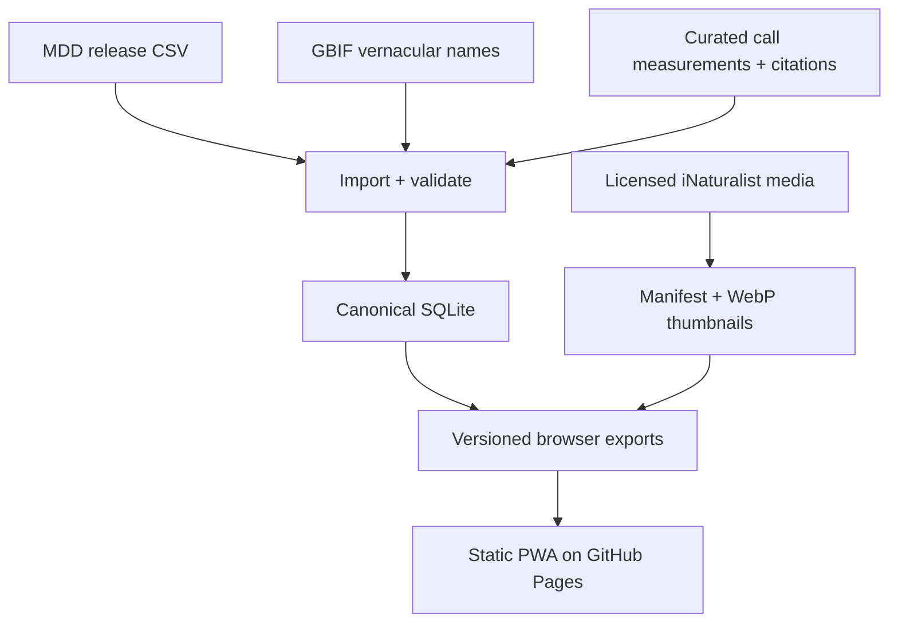

# Chiroptree data, media, and offline implementation plan

## Purpose

Evolve Chiroptree from a static page with several hand-maintained data structures into a static, offline-capable application with:

- Mammal Diversity Database (MDD) as the canonical taxonomy source;
- a normalized, source-traceable store for echolocation information;
- versioned Danish vernacular names and licensed thumbnail snapshots;
- a weekly **check-and-propose** update workflow; and
- no production application server or hosted database.

The public site remains GitHub Pages. SQLite is the canonical *build-time* database, not a network service.

## Goals and non-goals

| Goals | Non-goals for this project |
|---|---|
| Eliminate duplicated taxonomy hierarchy and count maintenance | User accounts, editing in production, or a public write API |
| Preserve provenance for every displayed call value and image | Full-resolution image archive |
| Work offline after installation | Guarantee a photo for every accepted species |
| Review every data update before publishing | Replacing the MDD as the taxonomic authority |
| Retain the current fast, static GitHub Pages model | Continuous uncontrolled harvesting or silent deployment |

## Target design



### Repository layout

Use two versioned repositories (or, initially, two branches) to prevent binary and generated data history from overwhelming application development.

```text
chiroptree-app/
  src/                         application HTML/CSS/JS or a small frontend build
  scripts/build-site.py         materialises a release into public/
  public/                       generated deployment directory; not committed
  .github/workflows/pages.yml

chiroptree-data/
  chiroptree.sqlite             canonical release database
  exports/taxonomy.json         compact browser export
  exports/calls.json            compact browser export
  exports/names.json            compact browser export
  exports/media-manifest.json
  images/<mdd-id>.webp          one thumbnail for each eligible image
  reports/<release-id>.md       import/validation/change reports
  metadata/release.json         data release ID, source checksums, build time
```

The application repository pins an immutable data release (tag or commit SHA). A deployment copies that release into `public/data/` and `public/images/`.

**Initial simplification:** begin in one repository if desired, but keep generated files in `data-release/` and make the release manifest explicit. Split it once image history becomes inconvenient.

## Canonical SQLite schema

SQLite is the source of truth for releases. Browser JSON is generated from it and must never be edited manually.

### Taxonomy and names

| Table | Key fields | Notes |
|---|---|---|
| `release` | `release_id`, `mdd_doi`, `mdd_version`, `source_checksum`, `imported_at` | One row per imported MDD release |
| `taxon` | `taxon_id`, `release_id`, `mdd_id`, `accepted_name`, `rank`, `parent_taxon_id` | MDD stable ID is the preferred association key |
| `taxon_rank_snapshot` | `taxon_id`, family through genus fields | Denormalized ranks for fast export/query |
| `distribution` | `taxon_id`, `country_name`, `source`, `evidence_level` | Preserve MDD and any separate occurrence supplement distinctly |
| `common_name` | `common_name_id`, `taxon_id`, `language`, `name`, `source_id`, `preferred`, `retrieved_at` | Store all Danish names; do not invent missing names |
| `external_taxon_match` | `taxon_id`, `provider`, `provider_key`, `matched_name`, `match_method` | GBIF key and whether current or MSW3 fallback matched |

### Calls and sources

| Table | Key fields | Notes |
|---|---|---|
| `reference` | `reference_id`, DOI, bibliographic citation, URL, licence | One normalized record per publication/dataset |
| `call_measurement` | `measurement_id`, `taxon_id`, `parameter`, `value_min`, `value_max`, `unit`, `statistic` | A factual measurement or explicitly labelled synthesis |
| `call_context` | `measurement_id`, `call_phase`, habitat, country, method, sample size, sex/age | Nullable fields; absence must remain explicit |
| `call_measurement_source` | `measurement_id`, `reference_id`, page/table/figure | Supports multiple sources per measurement |
| `call_inference` | `taxon_id`, `inherited_from_taxon_id`, `scope` | Records a genus/family guide separately from direct evidence |

Required values for `parameter`: `call_type`, `duty_cycle`, `peak_frequency_khz`, with later extension for start/end/minimum frequency, duration, inter-pulse interval, bandwidth, harmonic, and sound-pressure level.

The UI must distinguish:

- **species measurement** — evidence directly associated with this species;
- **genus guide** — inherited from a genus-level source;
- **family guide** — inherited broad reference;
- **no data** — no numerical or descriptive claim shown as an estimate.

### Media

| Table | Key fields | Notes |
|---|---|---|
| `media_asset` | `asset_id`, `taxon_id`, `provider`, `provider_asset_id`, `source_url`, `local_path` | One chosen thumbnail per taxon at a time |
| `media_license` | `asset_id`, licence code, creator, attribution, licence URL | Required before publishing any cached asset |
| `media_snapshot` | `asset_id`, `source_hash`, `retrieved_at`, `width`, `height`, `file_size_bytes`, `status` | Makes a local snapshot auditable |

`media_asset.local_path` uses `images/<mdd-id>.webp`. Scientific names remain display labels, never asset identifiers.

## Taxonomy-tree implementation

1. Retain a minimal curated `backbone.yaml` only for topology that MDD rank fields cannot express (suborders/superfamilies and cladogram arrangement).
2. Generate every family, subfamily, tribe, genus, species list, and count from SQLite/MDD data.
3. Remove the hand-maintained `ATLAS`, `SP`, and duplicated family counts after feature parity is reached.
4. For taxa absent from the preferred visual backbone, render them in a clearly marked “unplaced in display backbone” group and fail validation in release mode.
5. Make cards, search, country filtering, and tree all consume the same generated export.

## Data-update workflow

### Schedule and trigger

Create `.github/workflows/data-sync.yml`:

- `schedule`: weekly, at a low-traffic UTC time;
- `workflow_dispatch`: manual rerun;
- optional manual input `force_refresh_media` for deliberate media re-selection.

MDD v2.5 is an immutable release; the workflow should check the MDD concept DOI/latest release metadata and compare release ID/checksum. It should do nothing if there is no new MDD release. It must not rewrite a release merely because the weekly clock ran.

### Stages

1. **Discover** — fetch metadata for the current MDD release; record URL, DOI, version and checksum.
2. **Stage import** — download source CSV, validate checksum, and import into a temporary SQLite database.
3. **Reconcile** — preserve associations by MDD ID; attempt explicit scientific-name reconciliation only when an ID is unavailable; produce a review list for splits, synonym changes and unresolved items.
4. **Refresh derivatives** — update GBIF Danish names, map resolution, browser exports, and tree backbone checks.
5. **Refresh media incrementally** — revalidate assets in the manifest; fetch only missing, invalid, deliberately expired, or source-changed items.
6. **Validate** — run hard gates listed below.
7. **Report** — create a human-readable change report with counts, taxa added/removed/renamed/moved, unresolved records, changed image licences, and data-quality warnings.
8. **Propose** — open a pull request in the data repository. No automatic production deployment.
9. **Release** — maintainer reviews, merges and tags the data release; the app workflow deploys the pinned tag/commit.

### Validation gates

The sync job fails when any condition below is true:

- MDD checksum mismatch or parse failure;
- duplicate MDD ID, duplicate accepted taxon/rank pair, or missing required rank for a species;
- a taxon has an invalid parent/rank relationship;
- a family in the visual backbone has no imported family, or an imported family lacks a placement;
- browser export count differs from SQLite count;
- unresolved country names exist after applying the map name index;
- a Danish name references no taxon, lacks language/source, or has an unresolved GBIF mapping that was previously resolved;
- a displayed direct call measurement lacks a source reference;
- an exported cached image lacks a compatible licence, creator/attribution, or local file;
- generated PWA manifest/service-worker precache list is inconsistent with the output directory.

Warnings, rather than failures, include expected MDD species-count changes, taxa without photos, call values lacking contextual metadata, and name changes requiring editorial review.

## Image-snapshot policy

### Scope

Publish one 256–320 px WebP thumbnail per accepted species **when** an image with a redistribution-compatible licence and complete attribution is available. A species with no eligible image is represented by a local placeholder and a manifest status of `unavailable`.

Estimated all-thumbnail package: approximately 30–60 MB for 1,514 species, plus a small manifest. It remains acceptable for GitHub Pages and offline installation; high-resolution originals are excluded.

### Selection and refresh rules

1. Match exact accepted species name against iNaturalist taxon records.
2. Prefer a suitably licensed taxon default photo.
3. Otherwise choose a research-grade observation photo from an allowed licence set, using a deterministic quality order.
4. Record exact source asset/observation ID, author, licence, attribution, source URL, dimensions, content hash and retrieval time.
5. Convert to WebP with fixed maximum dimension and quality; preserve no EXIF beyond required manifest provenance.
6. On weekly checks, retain an existing valid snapshot unless the source is missing, licence becomes incompatible, a curator forces refresh, or the selection rules choose a materially better image.
7. Never delete a previously published asset from a release; a new release may select a different image and preserve the prior release for reproducibility.

### Attribution in the UI

Every image shows creator, licence and source link in the species card. The offline view uses the stored attribution from the manifest—never live API metadata. Include an “image details” affordance for full provenance.

## Offline/PWA implementation

### Required assets

- application shell (HTML, CSS, JavaScript);
- compact taxonomy, calls, names, map and media manifest exports;
- all available WebP thumbnails;
- a service worker and web app manifest;
- local placeholder image and attribution view.

### Caching behavior

- Precache the application shell and core data immediately.
- Offer **“Install full offline image pack”** rather than forcing mobile users to cache 30–60 MB.
- A desktop/lab deployment can enable full-pack pre-cache by configuration.
- Cache updates use versioned release URLs, then atomically switch to the new release after all required assets download.
- If image download is incomplete, preserve the prior complete offline release.
- Display the currently installed data-release version and last-updated time.

### Browser data access

Phase 1 exports JSON and retains existing client-side patterns.

Phase 2 optionally ships `chiroptree.sqlite` and uses SQLite-WASM for advanced offline filtering, source exploration and multi-measurement call queries. Do not make SQLite-WASM a prerequisite for basic browsing/search.

## Changes to the application build and deployment

The existing Pages deployment stays structurally the same: it uploads `public/`. Replace `build.sh` with a deterministic build script that:

1. verifies the pinned data-release manifest and checksums;
2. copies/links the release exports and `images/` into `public/`;
3. builds the application shell and service worker precache manifest;
4. verifies every referenced asset exists;
5. emits `public/build-report.json` with app commit, data release and asset totals.

Add deployment gates:

- app unit/build checks;
- data release schema/checksum checks;
- static-server smoke test that loads the offline shell and a selected species card;
- inspect generated asset size and fail only on an agreed budget breach.

## Implementation phases

### Phase 0 — decisions and baseline (1 week)

- Confirm MDD usage/attribution terms, accepted media licences, and preferred data-repository arrangement.
- Capture current production UI behavior and a representative fixture set.
- Define expected taxonomy/card/map parity and offline package-size targets.

**Exit criteria:** approved schema, licences, versioning convention, and image policy.

### Phase 1 — canonical data foundation (2 weeks)

- Create SQLite schema, migrations, importer and deterministic JSON exporter.
- Import current MDD v2.5 data and compare all headline counts with the current JSON.
- Add machine-readable release manifest and validation report.

**Exit criteria:** SQLite-derived taxonomy JSON is functionally equivalent to current lookup data; validation runs in CI.

### Phase 2 — generated tree and UI parity (2–3 weeks)

- Generate expandable tree data from SQLite plus minimal backbone overlay.
- Remove duplicated counts and migrate cards/search/country filters to one export.
- Add regression fixtures for known taxonomy moves and country selections.

**Exit criteria:** no hand-authored genus/species lists remain in the display tree; all 21 families and all imported species are reachable or explicitly reported as unplaced.

### Phase 3 — provenance-grade calls and names (2–3 weeks)

- Import existing family/genus call guides as explicitly labelled inference records.
- Create reference and measurement editing/import format (CSV/YAML accepted into SQLite).
- Migrate Danish-name importer to taxon-ID association and source metadata.
- Update cards to show evidence level and linked citations.

**Exit criteria:** every displayed call value has an evidence label; direct values always have a source record.

### Phase 4 — media snapshot pipeline (2 weeks)

- Implement deterministic selection, download, resize, manifest creation and licence validation.
- Generate thumbnails for all eligible species; add unavailable/placeholder handling.
- Add attribution UI and media sync report.

**Exit criteria:** every published thumbnail has complete manifest provenance; package-size target is met; a failed media request cannot remove a valid prior snapshot.

### Phase 5 — PWA and offline validation (1–2 weeks)

- Add web manifest, service worker, release-aware cache handling, optional full-image-pack installation and offline status.
- Test cold install, offline reload, update rollback and a constrained network scenario.

**Exit criteria:** app, search, cards, map, calls, names and installed images work without a network connection.

### Phase 6 — weekly update automation (1–2 weeks)

- Add scheduled discovery/import/media sync workflow.
- Generate pull requests and changelog reports; configure required review checks.
- Document manual recovery, forced re-import, and release rollback.

**Exit criteria:** a dry-run produces a reviewable PR; unchanged MDD release produces no content change; an approved release deploys through current Pages workflow.

## Review checklist

- [ ] SQLite is accepted as the canonical build-time store.
- [ ] MDD stable ID is accepted as the primary association key.
- [ ] Tree hierarchy will be generated rather than duplicated by hand.
- [ ] All displayed call values must carry an evidence scope and provenance.
- [ ] Danish names remain source-backed and are never invented.
- [ ] One licensed thumbnail per eligible species is the target; missing images are acceptable.
- [ ] Full thumbnail caching is optional by default and enabled for lab deployments.
- [ ] Weekly sync creates a review PR rather than deploying silently.
- [ ] App source and generated data/media releases will be versioned separately.

## Open decisions

1. Should the data release live in a separate repository from day one, or begin as a branch in the app repository?
2. Which image licences are acceptable for redistribution: CC0 only, or CC-BY and CC-BY-SA with attribution?
3. Should GBIF country-occurrence supplementation remain enabled, and how should it be cited in the UI?
4. Who approves taxonomy changes, source additions, and image replacements?
5. Is browser-side SQLite-WASM needed in the first offline release, or can it follow JSON-based PWA parity?
6. What is the maximum default offline download budget for mobile users?
